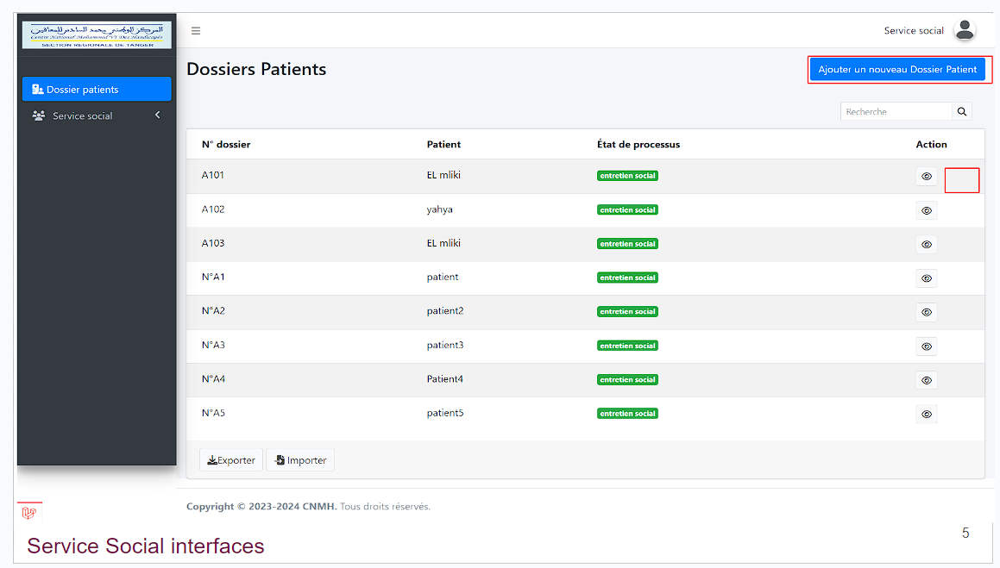
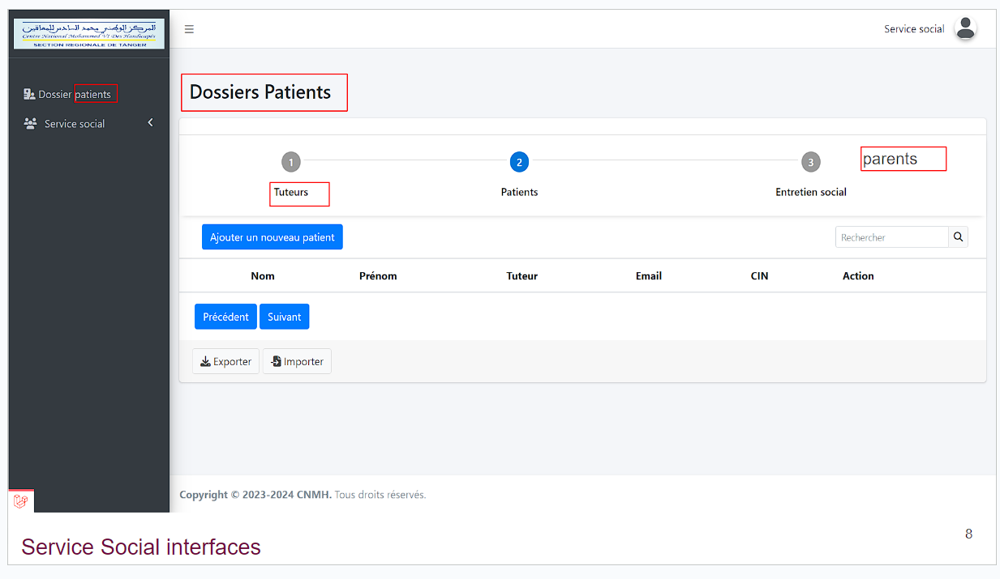
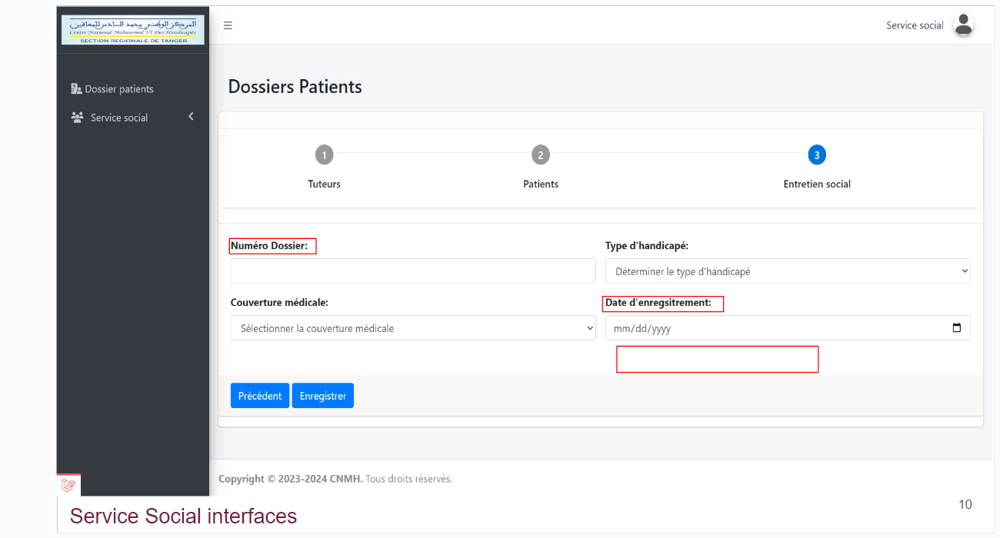
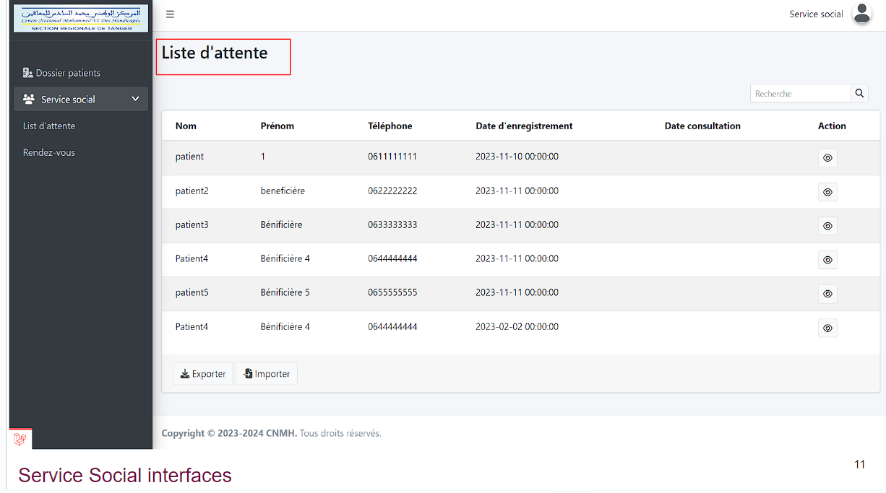

# les modifications 
1. Service Social :

- Service Social : dossier bénéficiare interface :

    - ”Bouton d'ajouter” éditer syntaxe de phrase.

    - Intégrer "Bouton éditer" dans le champ "action" du dossier patient.

- Service Social : Dossier Bénificiaire du tuteur :

    - Changer le terme "Patient" à "Bénéficiaire" dans tous l’applications.

- Service Social : Dossier Bénificiaire du tuteur f :

    - Manque la barre de progression.

    - Le tuteur peut être une personne physique ou morale.

    - Nécessité d'exister le lien  parental

    - Les parents doivent être identifiés avec leur nom et prénom.

- Service social dans ajouter dossier bénificiaire :

    - Changer le terme "Patient" à "Bénéficiaire"

    - Ajouter une barre oblique dans le dossier du bénéficiaire

- Service social dans ajouter dossier bénéficiaire  :

    - Les champs Téléphone, CIN, EMAIL, image, tuteur, association sont obligatoires, et les champs obligatoires sont marqués par un astérisque (*)

    - Ajouer champs CNE et association

- Service social : ajouter un dossier bénéficiaire dans la barre d'entretien social

    - Le numéro de dossier devrait s'auto-incrémenter.

    - Par défaut, la date du dossier devrait être celle d'aujourd'hui.

    - Ajouter les champs profession et Remarque

- Service social : liste d'attente :

    - Dans la liste d'attente placer la date d'enregistrement avant la consultation médicale.

    - La phase d'accueil doit apparaître dans la liste d'attente.

- Service social liste d'attente :
    - 

2. Médecin Générale

- Médecin Générale : Dossier bénéficiaire :

- Médecin Générale : Consultations :

