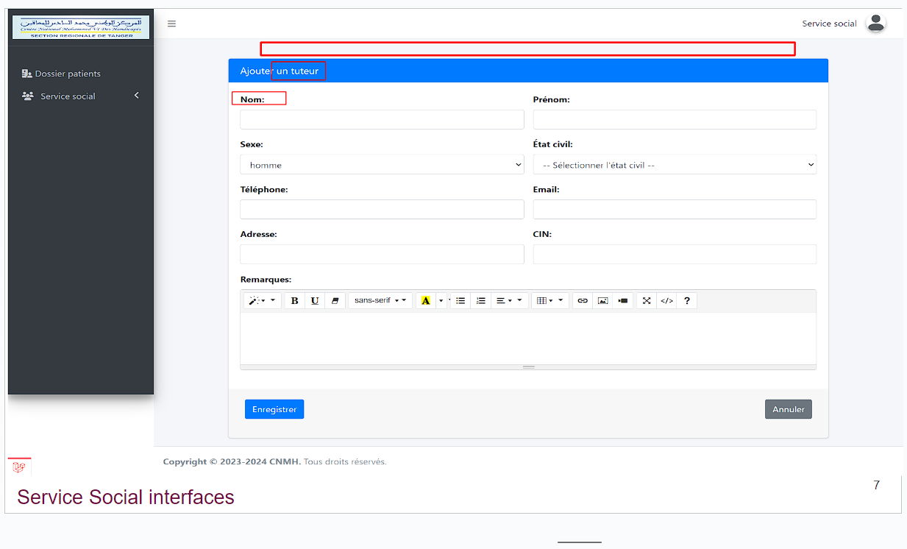
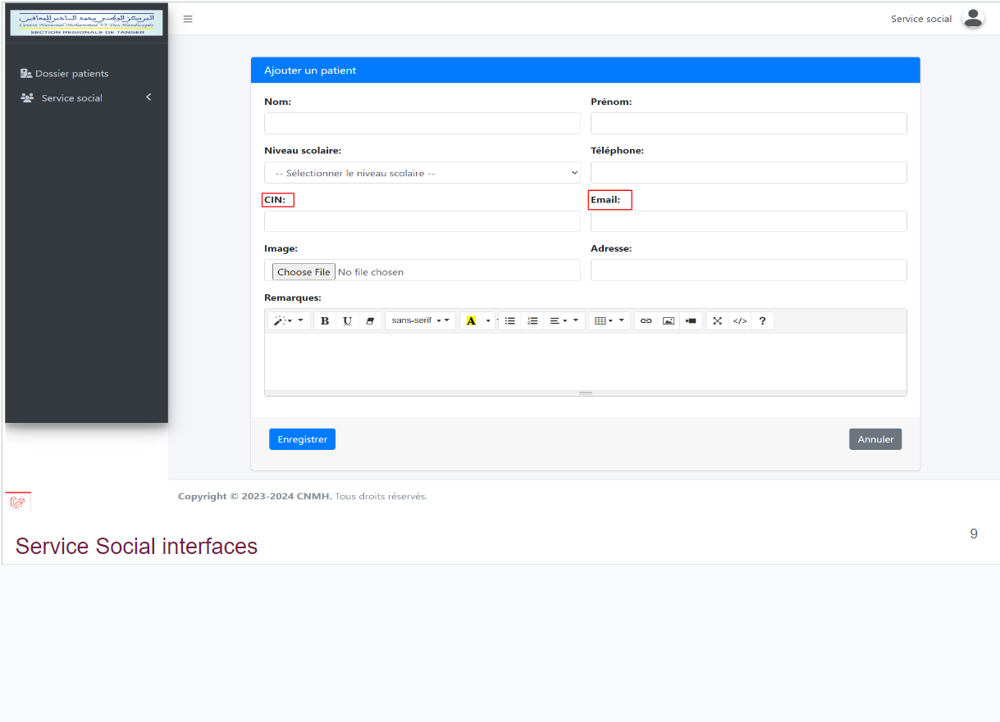
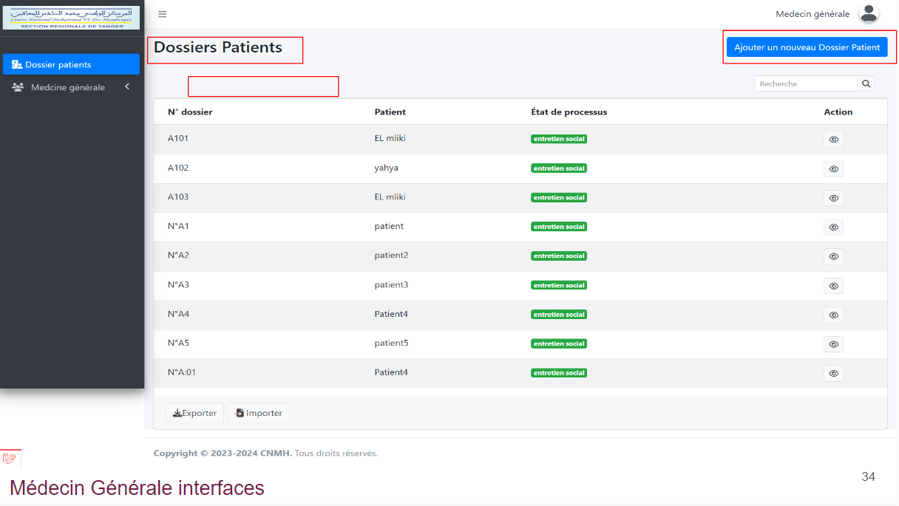
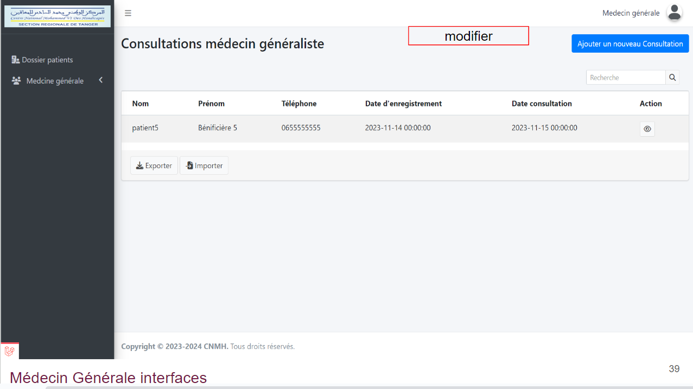

# les modifications 
1. Service Social :

- Service Social : dossier bénéficiare interface :

    - ”Bouton d'ajouter” éditer syntaxe de phrase.

    - Intégrer "Bouton éditer" dans le champ "action" du dossier patient.

- Service Social : Dossier Bénificiaire barre du tuteur :

    - Changer le terme "Patient" à "Bénéficiaire" dans tous l’applications.

- Service Social : Dossier Bénificiaire barre du tuteur :

    - Manque la barre de progression.

    - Le tuteur peut être une personne physique ou morale.

    - Nécessité d'exister le lien  parental

    - Les parents doivent être identifiés avec leur nom et prénom.

- Service social dans barre du bénificiaire :

    - Changer le terme "Patient" à "Bénéficiaire"

    - Ajouter une barre oblique dans le dossier du bénéficiaire

- Service social dans ajouter dossier bénéficiaire  :

    - Les champs Téléphone, CIN, EMAIL, image, tuteur, association sont obligatoires, et les champs obligatoires sont marqués par un astérisque (*)

    - Ajouer champs CNE et association

- Service social : ajouter un dossier bénéficiaire dans la barre d'entretien social

    - Le numéro de dossier devrait s'auto-incrémenter.

    - Par défaut, la date du dossier devrait être celle d'aujourd'hui.

    - Ajouter les champs profession et Remarque

- Service social : liste d'attente :

    - Dans la liste d'attente placer la date d'enregistrement avant la consultation médicale.

    - La phase d'accueil doit apparaître dans la liste d'attente.

- Service social Rendez-vous :
    - Ajouter un rendez-vous pour une consultation des dossiers non complets
    - Il faut ajouter la fonction de recherche et la pagination sur la page.
    - Il faut ajouter les actions 'modifier' et 'reporter un rendez-vous' dans le champ d'action.
    - date du rendez-vous incluant l'heure

- Service social : Rendez-vous dans barre list d'attete :
    - Il faut ajouter la fonction de recherche et la pagination sur la page.

2. Médecin Générale

- Médecin Généraliste: Liste des dossiers de bénéficiaires :
    - N'a pas le droit d'ajouter un dossier bénéficiaire.
    - Doit choisir et ajouter une fonction de filtrage 
    - Dossier medicale sa sera modifié par la médecine seulement
    - ajouter fuction de scanner les dossiers
    -  Générer statistique  ( voire les  commission , bilan )

- Médecin Généraliste : formulaire de planification d'un rendez-vous :
    - La date d'enregistrement ne sera pas modifiable .
    - Pour le diagnostic, commencez d'abord par un diagnostic général, puis, à la fin, ajoutez le diagnostic final.
    -  La phase de diagnostic devrait être une liste déroulante.
    - Possibilité de choisir plusieurs types de handicap pour une seule personne

- Médecin Généraliste :Consultations médecin générale:
    - Ajouter la fonction de modification

